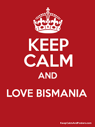

### Bismania del centro 

**En la república de Bismania del Centro los trabajadores empezaron a organizarse y los sindicatos ganan fuerza. Las manifestaciones se multiplican buscando mejoras laborales, aunque no siempre con éxito.**

### No llego a fin de mes

Dejando por un momento de lado que en este lejano país hay también desocupades, en este sistema laboral tenemos la información necesaria para averiguar qué actividad laboral realiza cada persona y su sueldo mensual, que se calcula como la cantidad de horas al mes que trabaja por el importe que cobra por hora.
Además, se sabe cual es el costo de vida en el país para una familia tipo.

**Averiguar qué porcentaje de trabajadores de Bismania del Centro no llega a fin de mes**, considerando que con su sueldo no llega a cubrir el costo de vida del país.

### Sindicatos únicos por actividad

La original organización sindical de este país, establece que cada actividad está representada por su sindicato, quien dice cual es el mínimo salario posible para esa actividad. El sindicato también establece el índice de insalubridad propio de la actividad, cuyo mínimo es 1 (valor que se considera normal), y a mayor valor significa mayor insalubridad. A su vez, en el país existe una ley que establece que el máximo de horas por semana que un trabajador puede trabajar en condiciones de salubridad normal es 40, pero nunca se sabe a cuánto lo llevará un proximo gobierno. 
Por ejemplo, el sindicato de los programadores establece que el salario mínimo es de 30 pesos bismanianos y que la insalubridad es 1;.en cambio el sindicato de los deshollinadores de chimeneas afirma que el salario minimo es de 50, pero tiene un indice de insalubridad 2.

**Averiguar si un trabajador está trabajando en exceso**, lo cual ocurre cuando la cantidad de horas que trabaja supera las permitidas por la ley, teniendo en cuenta que las horas permitidas por mes son las de la ley, pero afectadas de manera inversamente proporcional por el índice de insalubridad que indica el sindicato. Por ejemplo, un programador puede trabajar hasta 40 horas la mes, pero un deshollinador solo puede llegar a la mitad, es decir 20 horas mensuales. 
(se rumorea que el sindicato de presidentes establece la insalubridad en 40, por lo que ninguno de sus afiliados debería trabajar más de una hora) 

### Más sindicatos 

Algunos sindicatos son corruptos y los valores que establecen no los fijan ellos, sino la empresa con la que están arreglados. En caso que una misma empresa haya arreglado con varios sindicatos a la vez, a todos los fija las mismas condiciones. 
Otros sindicatos son en realidad una federación de sindicatos, que se pelean pero luego llegan a decisiones en conjunto. Si bien cada uno tiene sus posiciones respecto a temas salariales y de salubridad, a la hora de establecer las condiciones, se responde por el promedio de todos los sindicatos confederados.

**Hacer un aumento generalizado**, que implica incrementar en un porcentaje dado los salarios de todos los trabajadores explotados, ya sea porque no llegan a fin de mes o porque trabajan en exceso. 

### La hora de reclamar

Una protesta, supone una cierta cantidad de personas que participan y una serie de reclamos que se realizan, que pueden ser variados, pero los más típicos son los siguientes: 
- Aumentar un 50% el salario 
- Duplicar el salario
- Reducir la cantidad de horas a trabjar hasta la mitad pero ganando lo mismo que antes en total
- Que los trabajadores de cierta actividad cambien por otra, supuestamente más conveniente

En el país hay otras"protestas" que también son llevadas adelante por bismanianos y consisten en una serie de reclamos, que pueden ser:
- Disminuir el salario en un 13%
- Aumentar la cantidad de horas trabajadas, sin que impleque modificar el sueldo total. 
- Que los trabajadores de cierta actividad cambien por otra, tal vez menos conveniente

En caso de que una protesta sea exitosa, los reclamos se concretan, pero ojo, no toda protesta es exitosa. Cada protesta se lleva adelante con una diferente modalidad y esa puede ser la clave del éxito:
- Un paro con movilización es exitoso si participan al menos 10000 personas y si en el país hay menos policías activos que participantes de la protesta.
- Una protesta mediática es exitosa con que se sumen 100 personas, siempre y cuando la auspicie un medio de comunicación importante.
- Una protesta virtual es exitosa si se suman al menos 1000 trabajadores, y la cantidad de likes supera ampliamente la de trolls (5 a 1 como mínimo)

**Saber si una protesta puntual va a ser exitosa**

**Hacer que una protesta tenga los efectos correspondientes en caso de ser exitosa.**

#### Se pide resolver los requerimientos planteados y hacer algunos tests significativos
